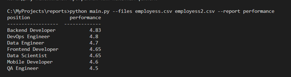
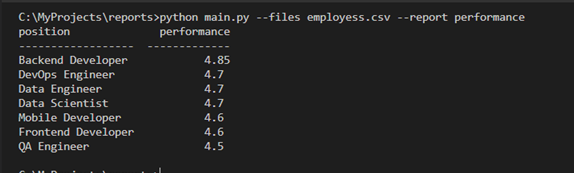

## 1) Запуск скрипта с выводом данных
## main.py --files employess.csv employess2.csv --report performance

## 2) Запуск скрипта с одним файлом
## python main.py --files employess.csv --report performance

